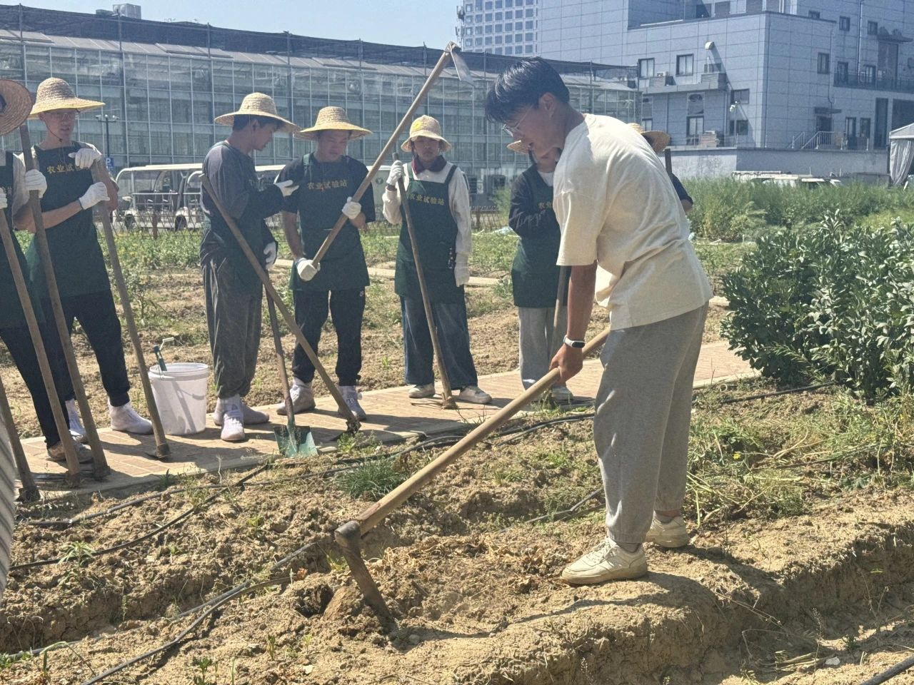
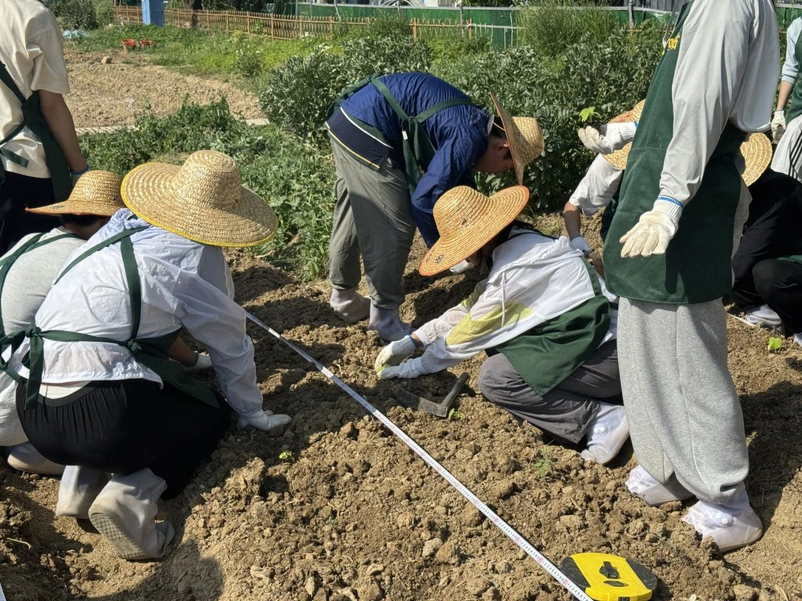
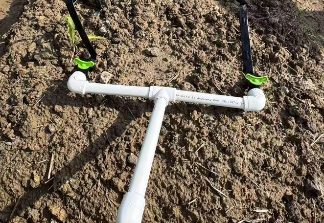

<!-- 第二次锄禾班实践活动 -->
# 🌾 整地起垄，实现滴灌

  一锄一铲皆汗水，一垄一畦皆希望

<!-- 翻地整地：图片左，文字右 -->

  
  

    <h2>🌿整地准备</h2>
    
在田间地头，我们俯身除草、清理枯枝落叶与碎石，一点点还原出干净平整的土地模样。每一锄、每一铲，都是与土地最亲密的对话，也是种植前最扎实的起点。

  

<!-- 施有机肥：文字左，图片右 -->

  

    <h2>🪣翻地施肥</h2>
    
我们为土壤均匀撒施了腐熟的有机肥，增强地力，改善土壤结构，既环保又有效，践行绿色农业理念。

  

  

<!-- 移栽蔬菜苗：图片左，文字右 -->

  
  

    <h2>🥬移栽蔬菜苗</h2>
    
我们将育好的菜苗小心翼翼地移植入田垄，按距离整齐排布，扶苗、覆土、浇水，每一步都细致入微。

  

<!-- 滴灌系统设计与测试：文字左，图片右 -->

  

    <h2>💧滴灌系统设计与测试</h2>
    
在老师指导下，我们组装并安装了滴灌管道系统，并成功完成通水测试，体验到了现代农业中科技的力量与效率。

  

  

